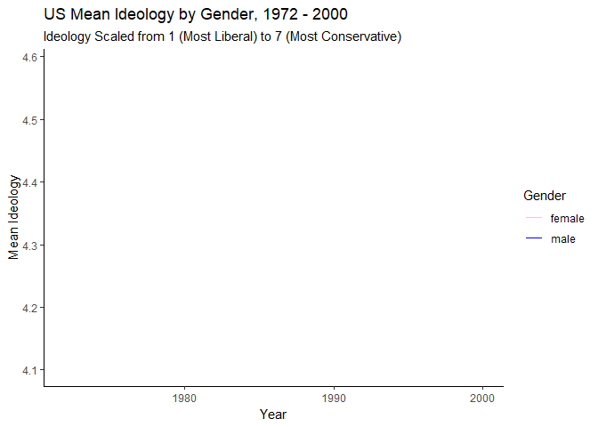

```{r setup, include=FALSE}
knitr::opts_chunk$set(echo = FALSE)
library(broom)
library(infer)
library(skimr)
library(gganimate)
library(rpart.plot)
library(tidymodels)
library(tidyverse)

nes <- read_rds("ch13_nes.rds") %>% 
  mutate(vote = factor(ifelse(dvote == 1, "Democrat", "Republican"), 
                          levels = c("Republican", "Democrat")))
```
```{r NES Polarization}
graph_nes <- nes %>%
  group_by(gender, year) %>%
  summarize(mean_ideology = mean(ideology))

nes_gender_animation <- ggplot(graph_nes, aes(x = year, y = mean_ideology, color = gender)) + geom_line() +
  theme_classic() +
  scale_color_manual(values = c("pink", "blue")) +
  labs(title = "US Mean Ideology by Gender, 1972 - 2000",
       subtitle = "Ideology Scaled from 1 (Most Liberal) to 7 (Most Conservative)",
       color = "Gender",
       x = "Year",
       y = "Mean Ideology",
       caption = "Data: National Election Survey"
       ) +
  transition_reveal(year)

anim_save("nes.gif", nes_gender_animation)

```

